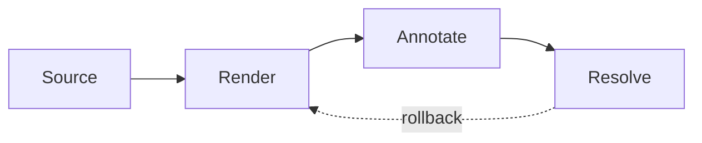

# Slidev Roadmap

<Counter :start="1" />

Notes:
Presenter notes should be collapsed below the slide.

---
layout: custom-hero
class: lead invert
background: /images/cover.png
transition: fade
---

# Implementation

- Detect Slidev metadata.
- Preserve readable Markdown.
- Avoid executing Vue.

---

# Dashboard Region

Activate visual annotation and select a specific dashboard panel.

---

# Source-backed Workflow

---

# Mermaid Region

---

# Repeated Occurrence

---

# Final Check

Anchors should remain stable across deck navigation.
