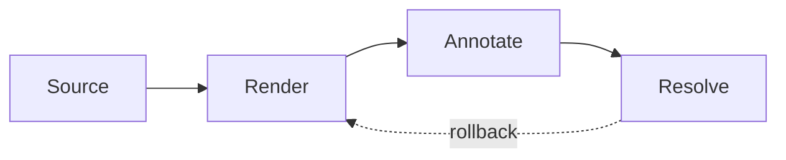

<!-- header: Commentary fixture -->
<!-- footer: Marp preview -->

# Marp Roadmap

Rendered as a Marp deck in Commentary.

<!-- Presenter note
Use this slide to verify speaker notes collapse correctly.
-->

---

<!-- _footer: Local footer -->

# Review Flow

- Open fixture PR.
- Confirm slide controls work.
- Toggle list view.

---

# Dashboard Region

Activate visual annotation and select the blocked timeline item, a risk cell, or a chart segment.

---

# Source-backed Workflow

---

# Mermaid Region

---

# Repeated Occurrence

The same SVG appears on another slide. Markers must remain occurrence-specific.

---

# Final Check

The final slide keeps anchors and source-line metadata stable.
