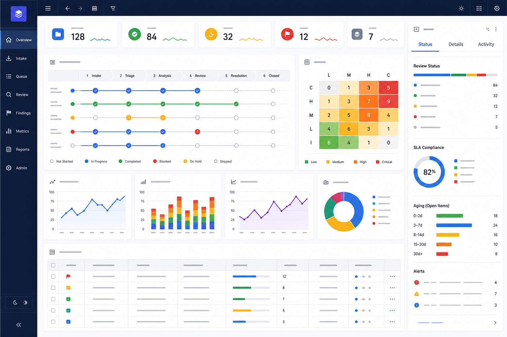
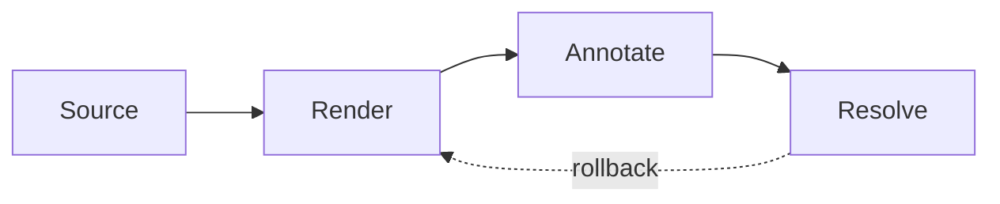

reveal: true

<!-- .slide: data-background="cover.png" class="center" -->

# Reveal Roadmap

Rendered as a Reveal.js deck in Commentary.

Notes:
Presenter notes should be collapsed below the slide.

---

# Horizontal Slide

- First item
<!-- .element: class="fragment fade-in" data-fragment-index="1" -->

- Second item
<!-- .element: class="fragment fade-in" data-fragment-index="2" -->

--

# Dashboard Region

Activate visual annotation and select a specific dashboard panel.

--

# Source-backed Workflow

--

# Mermaid Region

--

# Repeated Occurrence

--

# Vertical Child

This slide verifies vertical slide labels.

---

# Attribute Fallback

<!-- .slide: data-background="cover.png" {bad} -->

This slide intentionally includes invalid attribute syntax for warning coverage.
